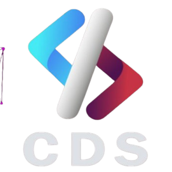

# CDS - Sistema de Gestión para la Comunidad de Desarrollo de Software



## Guía de Diseño y Estilo

Este documento sirve como guía para mantener la consistencia visual y funcional a través de todo el sistema CDS (Comunidad de Desarrollo de Software).

### 1. Tipografía

#### Fuente Principal
- **Familia**: Inter
- **CDN**: `https://fonts.googleapis.com/css2?family=Inter:wght@300;400;500;600;700&display=swap`
- **Uso**:
  - Títulos: Bold (700)
  - Subtítulos: Medium (500)
  - Texto general: Regular (400)
  - Texto secundario: Light (300)

#### Características Tipográficas
- **Tracking**:
  - Títulos: tracking-tight
  - Párrafos: tracking-normal
  - Información secundaria: tracking-wide
- **Tamaños**:
  - Títulos principales: text-2xl a text-4xl
  - Subtítulos: text-xl
  - Texto general: text-base
  - Texto secundario: text-sm
  - Notas o detalles: text-xs

### 2. Paleta de Colores

#### Colores Principales (basados en el logo)
- **Azul**: 
  - Claro: `#3B82F6` (blue-500)
  - Oscuro: `#2563EB` (blue-600)
  - Variación cyan: `#22D3EE` (cyan-400)

- **Morado**: 
  - Principal: `#9333EA` (purple-600)
  - Variación clara: `#A855F7` (purple-500)

- **Rosa/Rojo**:
  - Principal: `#EC4899` (pink-500)
  - Variación oscura: `#DB2777` (pink-600)

#### Colores del Tema Oscuro
- **Fondos**:
  - Fondo principal: `#111827` (gray-900)
  - Fondo secundario: `#1F2937` (gray-800)
  - Componentes: `#374151` (gray-700)
  - Bordes: `#4B5563` (gray-600)

- **Texto**:
  - Texto principal: `#F9FAFB` (gray-50)
  - Texto secundario: `#9CA3AF` (gray-400)
  - Etiquetas: `#D1D5DB` (gray-300)

### 3. Elementos de Diseño

#### Gradientes
- **Gradiente Principal**: `bg-gradient-to-r from-blue-500 via-purple-600 to-pink-500`
- **Gradiente para Texto**: `bg-gradient-to-r from-blue-400 via-purple-500 to-pink-400 text-transparent bg-clip-text`
- **Gradiente para Enlaces**: `bg-gradient-to-r from-blue-400 to-cyan-300 text-transparent bg-clip-text`

#### Sombras
- **Componentes principales**: `shadow-xl`
- **Botones en hover**: `hover:shadow-lg hover:shadow-purple-500/20`

#### Bordes y Esquinas
- **Radios de borde**:
  - Componentes grandes: `rounded-2xl`
  - Botones y entradas: `rounded-lg`
  - Chips o tags: `rounded-full`
- **Bordes sutiles**: `border border-gray-700`

#### Transiciones y Animaciones
- **Transición general**: `transition`
- **Transición completa**: `transition-all duration-200`
- **Efecto hover en botones**: `transform hover:-translate-y-0.5`

### 4. Componentes UI

#### Botones
```jsx
<button 
  className="py-2.5 px-4 text-white font-medium rounded-lg bg-gradient-to-r from-blue-500 via-purple-600 to-pink-500 hover:shadow-lg hover:shadow-purple-500/20 hover:opacity-95 transition-all duration-200 transform hover:-translate-y-0.5"
>
  Acción Principal
</button>
```

#### Campos de Formulario
```jsx
<div>
  <label className="block text-sm font-medium text-gray-300">
    Etiqueta
  </label>
  <input
    type="text"
    placeholder="Placeholder"
    className="w-full mt-1 px-4 py-2.5 bg-gray-700 text-gray-200 border border-gray-600 rounded-lg focus:ring-2 focus:ring-blue-500 focus:border-transparent focus:outline-none transition"
  />
</div>
```

#### Tarjetas
```jsx
<div className="bg-gray-800 rounded-2xl p-8 shadow-xl border border-gray-700">
  {/* Contenido */}
</div>
```

#### Enlaces
```jsx
<a href="#" className="font-medium bg-gradient-to-r from-blue-400 to-cyan-300 text-transparent bg-clip-text hover:underline">
  Enlace
</a>
```

### 5. Elementos Decorativos

#### Fondos con Patrones
- Círculos con gradiente y desenfoque
- Patrones SVG de puntos y líneas
- Opacidad baja (5%)

```jsx
{/* Elementos decorativos */}
<div className="absolute -top-10 -left-10 w-64 h-64 rounded-full bg-gradient-to-r from-blue-500 to-cyan-400 opacity-5 blur-xl" />
```

#### Patrones SVG
```jsx
{/* SVG pattern */}
<svg className="absolute top-0 left-0 w-full h-full opacity-5" xmlns="http://www.w3.org/2000/svg">
  <defs>
    <pattern id="smallGrid" width="20" height="20" patternUnits="userSpaceOnUse">
      <path d="M 20 0 L 0 0 0 20" fill="none" stroke="white" strokeWidth="0.5" opacity="0.3" />
    </pattern>
    <pattern id="dots" width="30" height="30" patternUnits="userSpaceOnUse">
      <circle cx="10" cy="10" r="1" fill="white" opacity="0.3" />
    </pattern>
  </defs>
  <rect width="100%" height="100%" fill="url(#smallGrid)" />
  <rect width="100%" height="100%" fill="url(#dots)" />
</svg>
```

### 6. Principios de Diseño

#### Espacio y Respiración
- Usar espaciado vertical consistente (`space-y-5`)
- Padding generoso en componentes (`p-8`)
- Margen entre secciones (`mb-8`)

#### Jerarquía Visual
- El logo siempre debe ser prominente
- Usar gradientes para elementos principales de acción
- Los elementos de mayor importancia deben tener mayor peso visual

#### Accesibilidad
- Mantener ratio de contraste alto entre texto y fondo
- Utilizar estados focus visibles con anillos (`focus:ring-2`)
- Etiquetas de formulario deben ser descriptivas

### 7. Integración de la Marca

- Usar siempre el logo oficial de CDS en su versión completa o reducida
- Mantener consistencia con los colores del gradiente que representa la identidad visual
- La tipografía Inter refleja el aspecto moderno y tecnológico de la marca

### 8. Componentes y Páginas Recomendadas

Para extender este sistema, considerar desarrollar:

- Navegación principal con el logo CDS
- Dashboard con estadísticas
- Sistema de notificaciones
- Perfiles de usuario
- Listados de proyectos
- Calendario de eventos
- Foro o sistema de comentarios

### 9. Configuración Técnica

Para usar esta guía de estilo, incluir en el proyecto:

1. **Tailwind CSS**: Para los estilos y utilidades
2. **Fuente Inter**: 
   ```html
   <link rel="preconnect" href="https://fonts.googleapis.com">
   <link rel="preconnect" href="https://fonts.gstatic.com" crossorigin>
   <link href="https://fonts.googleapis.com/css2?family=Inter:wght@300;400;500;600;700&display=swap" rel="stylesheet">
   ```
3. **Configuración de Tailwind**:
   ```js
   // tailwind.config.js
   module.exports = {
     theme: {
       extend: {
         fontFamily: {
           sans: ['Inter', 'sans-serif'],
         },
       },
     },
   }
   ```

## Licencia

[Especificar licencia]

---

© 2023 Comunidad de Desarrollo de Software (CDS)
# template-login-comunidad
